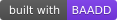

[](https://github.com/dweng0/PyLex/actions/workflows/evolve.yml)
[](https://github.com/dweng0/BAADD)


Welcome to PyLex! A customizable lexer (tokenizer) designed to tokenize programming languages using a user-defined configuration. The key feature of this lexer is the ability to define how the tokenization process works through a YAML configuration file. You can either use the provided lexer configuration, or role your own by following the provided [schema](lexer_schema.json)

### Features

-   Customizable Lexer Configuration: Define tokens, patterns, and delimiters in a YAML file.
-   Supports Multiple Programming Languages: Tokenize different programming languages by providing appropriate lexer configurations.
-   Pattern Matching with Regular Expressions: Use regex patterns for flexible token matching.
-   Easy to Extend: Add new token types or modify existing ones without changing the core lexer code.

**Please note this is an early concept and some languages have only been tested with "hello world" examples. If you would like to update the sanity_tests or the lexer_config yaml feel free to submit a pr!**

## Project Roadmap

| Stage                                              | Description                                                                                                                                                                              | Status        |
| -------------------------------------------------- | ---------------------------------------------------------------------------------------------------------------------------------------------------------------------------------------- | ------------- |
|                     | Taking the initial idea and testing its feasibility. Looking at the infrastructure required to allow seemless open source input                                                          | Current stage |
|              | Improving the lexer based on early testing and feeback.                                                                                                                                  |               |
|  | Maturing the lexer through iterative improvements and feature updates.                                                                                                                   |               |
|                     | Major updates and bugs are complete and the project is now in a maintenance state, adding new languages and updating the lexer if languages add features that the lexer does not support |               |

## Contributors needed!


Well... ahem... I need you really, its quite a big project and if you are interested in taking part, please do let me know! Even if you dont write in python, we could use example code in the `sanity_tests/` folder to actually test the lexer properly. Its initial phase has `hellow world` code examples taken from respective official documentation and doesn't help us to capture all the different common day to day scenarios.

With ~~our python army, we could take over the WORLD!~~ help from the lovely open source community. We could build and develop a lexer that supports multiple languages!


Even if you're un familiar with compilers and lexers in particular. they are surprisingly simple and I am happy to help get you up to speed!

### Installation

Clone the Repository

```bash
git clone https://github.com/dweng0/PyLex.git
cd PyLex
```

### Install Dependencies

```bash
pip install -r requirements.txt
```

Or with [uv](https://github.com/astral-sh/uv) (recommended for local dev):

```bash
uv venv && uv pip install -r requirements.txt
```

### Running locally

Tokenise a file using one of the bundled lexers:

```bash
python3 main.py path/to/file.py lexers/python.yaml
```

Pretty-print the JSON output:

```bash
python3 main.py path/to/file.py lexers/python.yaml | python3 -m json.tool
```

Available lexers: `python`, `javascript`, `typescript`, `rust`, `cpp`, `fortran`, `vyper`

### Running tests locally

```bash
python3 -m pytest tests/ -v
```

Or with uv:

```bash
uv run pytest tests/ -v
```

### Available lexers

There are quite a few lexers, however please note they are a best guess effort during this early phase and may not capture and properly tokenize all input. The most tested configs are:
`rust.yaml`, `python.yaml` and `javascript.yaml`

```bash
lexers/
├── javascript.yaml
├── cpp.yaml
├── rust.yaml
├── fortran.yaml
├── python.yaml
├── typescript.yaml
├── vyper.yaml
```

There may be more lexers added not listed above during the early phase of this project. check the [folder](lexers/) for the complete yaml list

## How it works

#### Lexer Configuration YAML File

The lexer uses a YAML file to define how tokenization works. This file specifies:

-   Delimiters: Characters that separate tokens.
-   Tokens: A list of token definitions, each with a type and either a value or a regex pattern.

#### YAML File Structure

```yaml
lexer_target: javascript
version: 1.0.0
delimiters: " \t\n\r;(){}[]+=-\*/%&|^!<>?:.,"
tokens:

-   type: keyword
    value: "function"
-   type: identifier
    pattern: "[a-zA-Z\_][a-zA-Z0-9_]\*"
-   type: operator
    value: "="
-   type: number
    pattern: "\\b\\d+\\b"
-   type: string_literal
    pattern: "'([^'\\\\]|\\\\.)\*'"

# Add more token definitions as needed
```

`lexer_target`: (Optional) Indicates the target language or purpose.
`delimiters`: A string of characters used to delimit tokens.
`version`: The version for the given lexer config
`tokens`: A list of token definitions.

Each token definition can have:

`type`: A label for the token (e.g., keyword, identifier, operator).
`value`: (Optional) An exact string value to match.
`pattern`: (Optional) A regex pattern to match.

Note a token **must** have either a value **or** a pattern

### Example Usage

Input JavaScript File (test.js)

```javascript
function greet(name) {
    console.log('Hello, ' + name + '!')
}
```

Lexer Configuration (lexer_config.yaml)

```yaml
lexer_target: javascript
delimiters: " \t\n\r;(){}[]+=-\*/%&|^!<>?:.,"
tokens:

-   type: keyword
    value: "function"
-   type: keyword
    value: "console"
-   type: identifier
    pattern: "[a-zA-Z\_][a-zA-Z0-9_]\*"
-   type: string_literal
    pattern: "\"([^\"\\\\]|\\\\.)\*\""
-   type: operator
    value: "+"
-   type: punctuator
    value: "{"
-   type: punctuator
    value: "}"
-   type: punctuator
    value: "("
-   type: punctuator
    value: ")"
-   type: punctuator
    value: ";"
-   type: whitespace
    pattern: "\\s+"
```

### Running the Lexer

    ``` bash
    python main.py test.js lexer_config.yaml
    ```

    Sample Output

    ``` plaintext
    {'value': 'function', 'type': 'keyword'}
    {'value': ' ', 'type': 'whitespace'}
    {'value': 'greet', 'type': 'identifier'}
    {'value': '(', 'type': 'punctuator'}
    {'value': 'name', 'type': 'identifier'}
    {'value': ')', 'type': 'punctuator'}
    {'value': ' ', 'type': 'whitespace'}
    {'value': '{', 'type': 'punctuator'}
    {'value': '\n ', 'type': 'whitespace'}
    {'value': 'console', 'type': 'keyword'}
    {'value': '.', 'type': 'operator'}
    {'value': 'log', 'type': 'identifier'}
    {'value': '(', 'type': 'punctuator'}
    {'value': '"Hello, "', 'type': 'string_literal'}
    {'value': ' ', 'type': 'whitespace'}
    {'value': '+', 'type': 'operator'}
    {'value': ' ', 'type': 'whitespace'}
    {'value': 'name', 'type': 'identifier'}
    {'value': ' ', 'type': 'whitespace'}
    {'value': '+', 'type': 'operator'}
    {'value': ' ', 'type': 'whitespace'}
    {'value': '"!"', 'type': 'string_literal'}
    {'value': ')', 'type': 'punctuator'}
    {'value': ';', 'type': 'punctuator'}
    {'value': '\n', 'type': 'whitespace'}
    {'value': '}', 'type': 'punctuator'}
    ```
    ### Creating Your Own Lexer Configuration
    You can create your own lexer configuration YAML file to tokenize different programming languages or customize tokenization rules.

### Define Delimiters

List all characters that should act as token separators.

```yaml
delimiters: " \t\n\r;(){}[]+=-\*/%&|^!<>?:.,"
```

Define Tokens

Create a list of token definitions, specifying either a value for exact matches or a pattern for regex matches.

```yaml

tokens:

-   type: keyword
    value: "if"
-   type: identifier
    pattern: "[a-zA-Z\_][a-zA-Z0-9_]\*"
-   type: number
    pattern: "\\b\\d+\\b"
-   type: string_literal
    pattern: "\"([^\"\\\\]|\\\\.)\*\""

# Add more tokens as needed
```

### Order Matters

-   Place more specific tokens before more general ones.
-   Multi-character operators should come before single-character operators.
-   Keywords should come before identifiers to prevent keywords from being matched as identifiers.
-   Proper Escaping

In YAML, escape backslashes with another backslash (\\).
For regex patterns, ensure patterns are correctly specified.
Project Structure (This is quite an early project so may change in future).

```bash
PyLex/
├── lexers/
│ ├── lexer.py # Core lexer functions
├── main.py # Entry point of the application
├── tokenizer.py # Tokenizer logic
├── requirements.txt # Python dependencies
├── tests/
│ └── test.js # Sample input files
├── lexer_config.yaml # Sample lexer configuration
├── README.md # Project documentation
```

## Contributing

Contributions are welcome! If you'd like to improve the lexer, add new features, or fix bugs, please follow these steps:

Fork the Repository

Click the "Fork" button at the top-right corner of the repository page.

Clone Your Fork

```bash
git clone https://github.com/CodeCrafter-Guy/PyLex.git
```

Create a Feature Branch

```bash
git checkout -b feature/your-feature-name
```

Commit Your Changes

```bash
git commit -am 'Add new feature'
```

Push to Your Fork

```bash
git push origin feature/your-feature-name
```

Open a pull request on the original repository with a description of your changes.

## License

This project is licensed under the MIT License.
